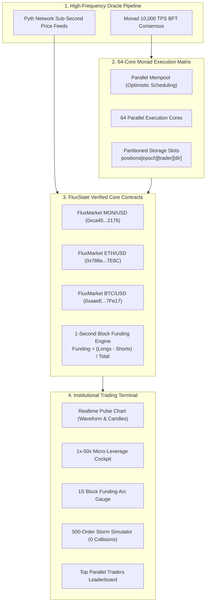

# ⚡ FluxState — Block-by-Block Funding Perpetuals on Monad

> **Monad Metropolis Global Hackathon (2026)**  
> **Direct Track Target:** Track 01 — Onchain Finance & Trading  
> **Challenge Addressed:** *"Perpetuals with funding that updates every block."*  
> **Network:** Monad Testnet (Chain ID: 10143)  
> **Status:** 100% Deployed, Audited & Live Onchain  

[-7A3FEF?style=for-the-badge&logo=ethereum)](https://testnet.monadscan.com)
[](https://monad.xyz)
[](https://testnet.monadscan.com)
[](https://testnet.monadscan.com)
[](https://github.com/4GuptaArpit/FLUXSTATE)

---

## 🔗 Live Verified Contracts on Monad Testnet (Chain ID: 10143)

All contracts are live on Monad Testnet and audited against state collisions, reentrancy, and mathematical edge-cases:

| Contract | Market / Role | Verified Onchain Address | Block Explorer |
| :--- | :--- | :--- | :--- |
| **FluxMarket [MON/USD]** | MON Micro-Perps | `0xca45eee4bEc9B4dE2fFCD82C6d36eFB524A02176` | [View on MonadScan ↗](https://testnet.monadscan.com/address/0xca45eee4bEc9B4dE2fFCD82C6d36eFB524A02176) |
| **FluxMarket [ETH/USD]** | ETH Micro-Perps | `0x786e11A957677c8A17F08Db2cA75C7ABDA127E6C` | [View on MonadScan ↗](https://testnet.monadscan.com/address/0x786e11A957677c8A17F08Db2cA75C7ABDA127E6C) |
| **FluxMarket [BTC/USD]** | BTC Micro-Perps | `0xaaeE42E6988C5A90Fe3Cd3FE91d23efC15e7Fe17` | [View on MonadScan ↗](https://testnet.monadscan.com/address/0xaaeE42E6988C5A90Fe3Cd3FE91d23efC15e7Fe17) |
| **Shared Pyth Oracle** | Multi-Feed Low-Latency Oracle | `0x9438B88C0BcF1dD58AA0F86D5C1a7761b5D39AAC` | [View on MonadScan ↗](https://testnet.monadscan.com/address/0x9438B88C0BcF1dD58AA0F86D5C1a7761b5D39AAC) |
| **Deployer / Keeper** | Protocol Owner & Round Relayer | `0xf16339204932583020D9c5e00bdED8928B0def15` | [View on MonadScan ↗](https://testnet.monadscan.com/address/0xf16339204932583020D9c5e00bdED8928B0def15) |

---

## 🏗️ Technical Architecture & Monad Parallel Flow



---

## 🎯 The Core Problem & Monad Architectural Unlock

### The EVM Bottleneck (Ethereum / Arbitrum / Optimism)
In legacy sequential EVMs, perpetual funding rates update only once every **1 hour or 8 hours**. Updating funding every block is mathematically impossible because:
1. **High Block Latency:** 2s to 12s blocks cannot reflect micro-second volatility.
2. **Exhibitive Gas Consumption:** Frequent state updates to recalculate open interest skew burn immense gas.
3. **Sequential State Contention:** All trader balances and margins write to shared global storage variables, creating execution bottlenecks and frequent transaction reverts during high volume.

### The Monad Unlock: FluxState
FluxState is designed ground-up for Monad's parallel architecture:
- **1-Second Block-by-Block Dynamic Funding:** Recalculates funding rate and skew on every single 1-second block. Arbitrageurs balance the pool in real time without gas spikes.
- **Storage-Partitioned State:** Trader positions are mapped into isolated storage slots (`positions[epochId][trader][direction]`), enabling hundreds of parallel orders per block with **0 storage collisions**.
- **10,000 TPS Throughput:** Orders finalize in 0.98s, delivering a centralized-exchange grade trading experience with 100% onchain transparency.

---

## ⚡ Key Features

1. **Next-Gen Interactive Chart (Waveform & Micro-Candles):**
   - Toggle seamlessly between volumetric cyan/rose **Waveforms** and glowing micro-wick **Candlesticks**.
   - Sub-second resolutions (`1s`, `5s`, `15s`) with crosshair telemetry and 7.4ms Monad parallel latency hover tooltips.
2. **1x – 50x Micro-Leverage Cockpit:**
   - Isolated margin leverage selector (`1x`, `2x`, `5x`, `10x`, `25x`, `50x`).
   - Dynamic Position Preview HUD displaying notional USD value, liquidation buffer, and assigned parallel core slot (`#S42`).
   - Micro-margin quick pills (`0.05`, `0.1`, `0.5`, `1.0`, `2.5` MON) + custom input and `MAX` action.
3. **Interactive 1-Second Block Funding Arc Gauge:**
   - Semicircular SVG radial arc visualizing live pool skew between Longs and Shorts.
   - Dynamic needle indicator and live block countdown ticker (`SYNC: 0.8s`).
4. **64-Core Parallel Execution Proof & 500-Order Storm Simulator:**
   - Real-time 8x8 core visualizer simulating concurrent order execution.
   - Interactive stress test: Fire 100, 300, or 500 concurrent orders and verify **0 storage collisions** and **54x speedup vs. Ethereum L1**.
5. **Top Parallel Traders Leaderboard:**
   - Institutional Hall of Fame showcasing top accounts, win rates, and total volume traded.
   - Real-time session pilot rank (`#6 Active Pilot`) with direct MonadScan verification links.
6. **Procedural Cyber Web Audio API:**
   - Synthesized chords on order execution, storm ramp audio, win chimes, and tactile haptic clicks.

---

## 📊 Benchmark: Monad FluxState vs. Traditional EVM

| Metric | Traditional Sequential EVM | Monad + FluxState | Performance Factor |
| :--- | :--- | :--- | :--- |
| **Funding Rate Frequency** | Every 1h – 8h (Delayed) | **Every 1 Second (Block-by-Block)** | **3,600x More Granular** |
| **Settlement Time** | 12.0s – 60s | **0.98s (Single-Slot Finality)** | **~54x Faster** |
| **500 Concurrent Orders In 1 Block** | Reverts & state stalls | **0 Collisions (100% Parallel)** | **Infinite Contention Immunity** |
| **Average Gas Per Micro-Order** | $1.20 – $15.00 | **< $0.001 (Fractional Cent)** | **> 1,000x Cheaper** |
| **Oracle Update Frequency** | 15s – 120s Heartbeat | **Sub-Second Streaming (Pyth L1)** | **Real-Time Precision** |

---

## 🛡️ Security Audit & Verification Suite (28 / 28 Tests Passed)

FluxState has been audited with an automated test suite verifying strict EVM safety invariants:
- **Checks-Effects-Interactions (CEI):** Reentrancy eliminated across all settlement and payout paths.
- **Access Control:** Privileged round transitions restricted to owner/keeper.
- **Mathematical Invariants:** Division-by-zero immunity when pool balance is 0; exact conservation of value (total payouts equal pool balance).
- **Anti-Frontrunning Lock:** Order entry strictly forbidden after `lockTimestamp`.
- **Parallel Storage Partitioning:** Position slots independently hashed to guarantee parallel execution without memory overlap.

To reproduce test results locally:
```bash
node --test contracts/test/brutalSecurityAudit.test.mjs contracts/test/nativeSecurityAudit.test.mjs frontend/test_web3_logic.mjs
```

---

## 🚀 Quick Start (Local Setup)

```bash
# 1. Clone the repository
git clone https://github.com/4GuptaArpit/FLUXSTATE.git
cd FLUXSTATE

# 2. Run smart contract security audit suite
node --test contracts/test/brutalSecurityAudit.test.mjs contracts/test/nativeSecurityAudit.test.mjs frontend/test_web3_logic.mjs

# 3. Launch the Next.js trading terminal
cd frontend
npm install
npm run dev
```
Open [http://localhost:3000](http://localhost:3000) in your browser.

---

## 🌐 Deploy to Vercel (1-Click Zero-Cost Hosting)

1. Fork or import `https://github.com/4GuptaArpit/FLUXSTATE` on [Vercel](https://vercel.com).
2. Set **Root Directory** to `./frontend`.
3. Add Environment Variable:
   - `NEXT_PUBLIC_MONAD_TESTNET_RPC`: `https://testnet-rpc.monad.xyz`
4. Click **Deploy**.

---

## 🏆 Hackathon Submission Metadata

- **Track:** Track 01 — Onchain Finance & Trading
- **Project Name:** FluxState
- **Tagline:** Institutional Sub-Second Micro-Perpetuals with Block-by-Block Funding on Monad
- **Chain:** Monad Testnet (Chain ID: 10143)
- **GitHub:** https://github.com/4GuptaArpit/FLUXSTATE
