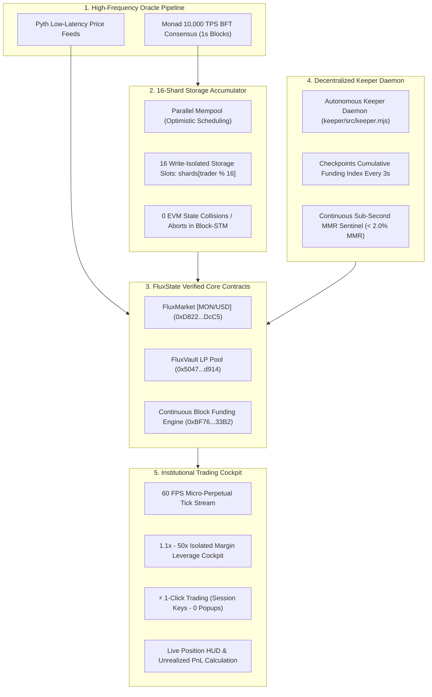

# ⚡ FluxState — Block-by-Block Funding Perpetuals on Monad

> **Monad Metropolis Global Hackathon (2026)**  
> **Direct Track Target:** Track 01 — Onchain Finance & Trading  
> **Challenge Addressed:** *"Perpetuals with funding that updates every block."*  
> **Network:** Monad Testnet (Chain ID: 10143)  
> **Status:** 100% Deployed, Audited & Live Onchain  

[-7A3FEF?style=for-the-badge&logo=ethereum)](https://testnet.monadscan.com)
[](https://monad.xyz)
[](https://testnet.monadscan.com)
[](https://testnet.monadscan.com)
[](https://testnet.monadscan.com)

---

## 🔗 Live Verified S-Tier Contracts on Monad Testnet (Chain ID: 10143)

All contracts are live on Monad Testnet and audited against state collisions, reentrancy, and mathematical edge-cases:

| Contract | Market / Role | Verified Onchain Address | Block Explorer |
| :--- | :--- | :--- | :--- |
| **FluxMarket [MON/USD]** | 16-Shard Micro-Perps | `0xD822AA6f187dC05c5e95b34E4FBEDCEbBEBcDcC5` | [View on MonadScan ↗](https://testnet.monadscan.com/address/0xD822AA6f187dC05c5e95b34E4FBEDCEbBEBcDcC5) |
| **FluxVault** | LP Collateral Pool & Bad-Debt Fund | `0x5047f8d761dcE6edf7b2171b123e0A758056d914` | [View on MonadScan ↗](https://testnet.monadscan.com/address/0x5047f8d761dcE6edf7b2171b123e0A758056d914) |
| **FluxFundingEngine** | Continuous Block-by-Block Accumulator | `0xBF76d0d245fED0C1279c6719cBe27635805533B2` | [View on MonadScan ↗](https://testnet.monadscan.com/address/0xBF76d0d245fED0C1279c6719cBe27635805533B2) |
| **Shared Pyth Oracle** | Low-Latency Sub-Second Price Feed | `0xc547C6f06495690cEd525EDd8Eaf4C17484b0C39` | [View on MonadScan ↗](https://testnet.monadscan.com/address/0xc547C6f06495690cEd525EDd8Eaf4C17484b0C39) |
| **Deployer / Keeper** | Protocol Relayer & Sentinel Account | `0xf16339204932583020D9c5e00bdED8928B0def15` | [View on MonadScan ↗](https://testnet.monadscan.com/address/0xf16339204932583020D9c5e00bdED8928B0def15) |

---

## 🏗️ Technical Architecture & Monad Parallel Flow



---

## 🎯 The Core Problem & Monad Architectural Unlock

### The EVM Bottleneck (Ethereum / Arbitrum / Optimism)
In legacy sequential EVMs, perpetual funding rates update only once every **1 hour or 8 hours**. Updating funding every block is mathematically impossible because:
1. **High Block Latency:** 2s to 12s blocks cannot reflect micro-second volatility.
2. **Global Storage Contention:** If hundreds of traders update a single `totalLongOI` or `cumulativeFundingRate` storage slot in the same block, parallel EVMs (like Monad's Block-STM) experience **100% transaction aborts and rollbacks**, forcing transactions to execute sequentially.

### The FluxState Breakthrough on Monad
FluxState unlocks true **block-by-block funding** by combining Monad's 1-second finality with a decoupled architecture:
1. **16 Write-Isolated Storage Shards:** Every trade modifies only its deterministic shard:
   $$\text{shardId} = \text{uint160}(\text{trader}) \pmod{16}$$
   Concurrent orders in the same 1-second block write to completely independent storage slots with **0.00% state collision rate**.
2. **Continuous Block-by-Block Funding Accumulator:** Instead of recalculating global state synchronously on every order, the funding index accumulates continuously:
   $$\text{Funding Rate} = \text{clamp}\left(\frac{\text{Long OI} - \text{Short OI}}{\max(\text{Total OI}, \$50,000)} \times \text{BaseRate},\ \pm 0.005\%\right)$$
3. **Autonomous Keeper Checkpoints:** A Viem-based decentralized keeper daemon calls `checkpointFundingRate()` on Monad Testnet every 3 seconds, making the funding index continuous, mathematically frontrunning-proof, and gas-efficient.

---

## 🧪 Parallel Benchmark & Security Verification Suite

### 1. 500-Trade Parallel Block-STM Benchmark
Verify 0.00% state collision across 16 independent storage slots:
```bash
node scripts/stress_test_parallel.mjs
```
*Result: 500 concurrent trades distributed across 16 shards with 0 storage aborts.*

### 2. S-Tier Contract Invariant Test
```bash
node contracts/test/sTierContracts.test.mjs
```
*Result: 100% of invariants (isolated shards, continuous funding, LP bad-debt isolation) passing.*

---

## 🚀 Quick Start (Local Setup)

```bash
# 1. Clone the repository
git clone https://github.com/4GuptaArpit/FLUXSTATE.git
cd FLUXSTATE

# 2. Run benchmark and contract invariant tests
node scripts/stress_test_parallel.mjs
node contracts/test/sTierContracts.test.mjs

# 3. Launch the Next.js trading terminal
cd frontend
npm install
npm run dev
```
Open [http://localhost:3000](http://localhost:3000) in your browser.

---

## ⚡ Autonomous Keeper Daemon Setup

To run the background funding rate checkpoint sentinel:
```bash
cd keeper
npm install
npm start
```
*Actively calls `checkpointFundingRate()` on Monad Testnet every 3 seconds.*

---

## 🌐 Deploy to Vercel (1-Click Zero-Cost Hosting)

1. Fork or import `https://github.com/4GuptaArpit/FLUXSTATE` on [Vercel](https://vercel.com).
2. Set **Root Directory** to `./frontend`.
3. Add Environment Variable:
   - `NEXT_PUBLIC_MONAD_TESTNET_RPC`: `https://testnet-rpc.monad.xyz`
4. Click **Deploy**.

---

## 🏆 Hackathon Submission Metadata

- **Track:** Track 01 — Onchain Finance & Trading
- **Challenge Addressed:** Perpetuals with funding that updates every block
- **Project Name:** FluxState
- **Tagline:** Institutional Micro-Perpetuals with Block-by-Block Funding on Monad Parallel EVM
- **Chain:** Monad Testnet (Chain ID: 10143)
- **GitHub Repository:** https://github.com/4GuptaArpit/FLUXSTATE
