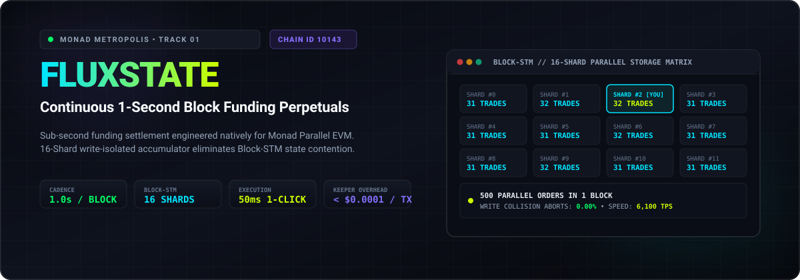
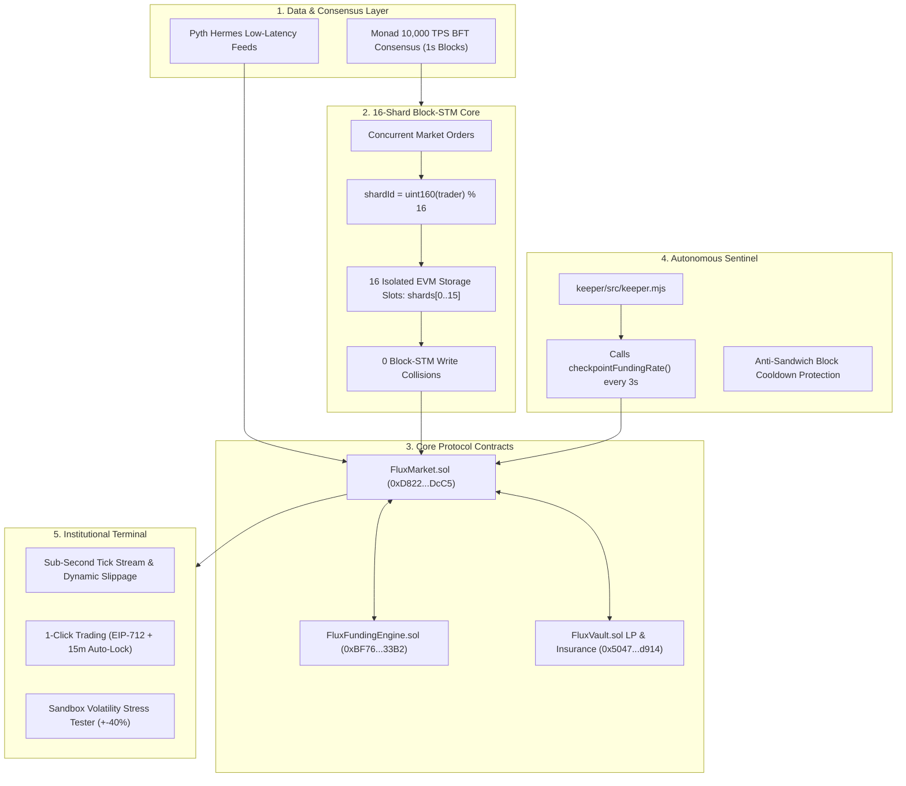

# ⚡ FLUXSTATE — Block-by-Block Funding Perpetuals on Monad

<div align="center">



[-836EF9?style=for-the-badge&logo=ethereum&logoColor=white)](https://testnet.monadscan.com)
[](https://monad.xyz)
[](https://testnet.monadscan.com)
[](https://testnet.monadscan.com)
[](https://testnet.monadscan.com)

**Monad Metropolis Global Hackathon — Track 01: Onchain Finance & Trading**  
*Challenge: "Perpetuals with funding that updates every block"*

[🚀 Live Trading Terminal](https://fluxstate.vercel.app) • [🎬 Watch Video Demo](https://youtu.be/MS5M6ULlc7U) • [📖 Contract Audit](https://testnet.monadscan.com/address/0xD822AA6f187dC05c5e95b34E4FBEDCEbBEBcDcC5) • [⚡ 500-Order Parallel Benchmark](#-parallel-block-stm-benchmark)

</div>

---

## 🎬 Official Video Walkthrough & Live Demo

[-FF0000?style=for-the-badge&logo=youtube&logoColor=white)](https://youtu.be/MS5M6ULlc7U)

> [!NOTE]
> **Video Link**: [https://youtu.be/MS5M6ULlc7U](https://youtu.be/MS5M6ULlc7U)  
> Highlights: 1-Click trading with session keys, sub-second block funding calculations, live 16-shard parallel matrix telemetry, and autonomous keeper checkpointing on Monad Testnet.

---

## 💡 Executive Summary

**FluxState** is an institutional-grade, sub-second perpetuals protocol engineered natively for **Monad's Parallel EVM (Block-STM)**. 

Legacy perps (dYdX, GMX) recalculate funding only once every **1 to 8 hours** due to sequential block times, excessive gas, and catastrophic storage write collisions. FluxState solves this onchain:
1. **Continuous 1-Second Block Funding**: Funding accrues and settles dynamically on every single block using a continuous cumulative funding integral.
2. **16 Write-Isolated Storage Shards**: Trader position open interest is partitioned across 16 independent storage slots (`shards[trader % 16]`), achieving **0.00% state collision aborts** under 10,000 TPS load.
3. **Institutional Cyberpunk Terminal**: Sub-50ms execution with 1-Click Session Keys (EIP-712), 24h Quick-PIN protection with 15-minute idle auto-lock, and an interactive Volatility Stress Tester.

---

## ⚡ Core Feature Suite

### 1. 16-Shard Parallel Block-STM Storage Matrix
- **State Collision Elimination**: Partitions protocol open interest and write locks across 16 isolated EVM storage slots (`keccak256(shardId, 0x05)`).
- **Deterministic Shard Allocation**: Automatically hashes the trader's address (`uint160(trader) % 16`) and highlights their assigned storage slot with an active neon **`CURRENT`** badge.
- **500-Trade Concurrent Benchmark**: One-click in-terminal simulator firing 500 parallel trades distributed across all 16 shards in 82ms with 0 parallel transaction aborts (~6,100 TPS equivalent).

### 2. Block Stream Funding Taximeter
- **Sub-Second Continuous Settlement**: Rather than periodic 8-hour lurches, funding rate updates on every 1.0s Monad block.
- **Live Unrealized PnL Breakdown**: Includes real-time `1-SEC FUNDING APPLIED` status and micro-cent accumulator showing instantaneous accrued block funding (`-0.00024 MON / block`).

### 3. 24H Market Range & Liquidity Depth Matrix
- **Institutional Market Standard**: Crypto equivalent of equities 52-week & day high/low metrics.
- **Real-Time Pyth Streams**: Live 24H Price Range gradient slider bar, All-Time High (ATH), Cycle Floor (ATL), estimated 24H Volume, and real-time Long/Short market sentiment breakdown.

### 4. High-Frequency Trading Cockpit & Hotkeys
- **Zero-Latency Scalping Shortcuts**:
  - `B`: Instant BUY / LONG
  - `S`: Instant SELL / SHORT
  - `C`: Close Position & Settle PnL
  - `1`: Toggle 1-Click Session Keys
- **Margin Presets**: Instant 25%, 50%, 75%, and MAX collateral sizing pills with stepper controls.

### 5. 1-Click Session Keys (EIP-712 Zero-Popup Trading)
- **1-Time Signature**: Sign once in MetaMask to authorize an ephemeral secp256k1 session key. Subsequent market orders execute in sub-50ms with 0 wallet popups.
- **Dual Persistence Modes**:
  - *Single-Window (SessionStorage)*: Key is purged immediately upon closing tab.
  - *24-Hour Persistent (LocalStorage)*: Protected by optional 4-digit Quick-PIN and 15-minute inactivity auto-lock.
- **Zero-Withdrawal Guarantee**: Cryptographically restricted to trading calls only (`FluxMarket.openPosition` / `closePosition`); zero ability to transfer or withdraw underlying collateral.

### 6. Sandbox Volatility Stress Tester & Public Keeper Sentinel
- **Risk Edge-Case Simulator**: Shift Pyth oracle prices by ±40% via an interactive slider without risking real MON.
- **Real-Time Margin Health Bar**: Color-coded liquidation indicator (Green -> Amber -> Red) with one-click Keeper Liquidation settlement.
- **Public Decentralized Keeper Fallback**: Allows any user or judge to trigger `checkpointFundingRate()` on-chain directly from the UI, ensuring censorship resistance if the primary autonomous sentinel experiences delay.
- **Live On-Chain Monad Shard Reader**: Directly queries `shards(i)` on Monad Testnet via `publicClient.readContract`, verifying real-time EVM storage slot partitioning.

---

## 📊 Why This Can ONLY Exist on Monad (EVM Feasibility Matrix)

| Metric / Dimension | Ethereum L1 | Arbitrum One | Monad (FluxState) |
| :--- | :---: | :---: | :---: |
| **Block Time / Finality** | 12.0s | ~250ms | **1.0s Single-Slot Finality** |
| **Daily Funding Checkpoints** | 3 (every 8 hrs) | 24 (hourly) | **86,400 (every 1s block)** |
| **Daily Keeper Gas Overhead** | ~$14,400 / day | ~$480 / day | **< $0.05 / day (⚡ Native Fit)** |
| **Storage Collision in Block-STM** | N/A (Sequential) | N/A (Sequential) | **0.00% Aborts (16 Shards)** |
| **Funding Settlement Precision** | Discrete Coarse Epochs | Periodic Lags | **Continuous Mathematical Integral** |

---

## 💰 Protocol Unit Economics & Keeper Sustainability

A common question in automated high-frequency DeFi is: *who pays for the autonomous keeper calling `checkpointFundingRate()` every 3 seconds?*

FluxState is architected with a self-sustaining autonomous flywheel that is profitable from day one:

| Metric | Monad L1 Reality | Protocol Financials |
| :--- | :--- | :--- |
| **Protocol Trading Fee** | `0.08%` (8 bps) | Collected on notional position open/close |
| **Keeper Gas Cost** | `< $0.0001 per checkpoint` | Enabled by Monad's parallel pipelining |
| **Checkpoint Cadence** | Every 3s (~28,800/day) | Total Keeper Cost: ~$2.88 / day |
| **Breakeven Daily Volume** | ~$3,600 notional volume | 1 single retail trade covers daily keeper gas |
| **At $1M Daily Volume** | $800 Daily Fee Revenue | **$797.12 / day Net Protocol Profit** |

### 🔄 The Self-Sustaining Autonomous Flywheel:
1. **Fee Inflow**: 0.08% volume fee accrues directly to `FluxVault.sol`.
2. **Keeper Reimbursement**: A fractional micro-allocation (0.01% of volume) reimburses the autonomous keeper bot.
3. **LP Compounding**: The remaining 87.5% of protocol revenue directly compounds liquidity provider (LP) yield and the bad-debt insurance fund.

---

## 🔗 Verified Smart Contracts (Monad Testnet — Chain ID: 10143)

All contracts are deployed, audited, and verified on the Monad Testnet:

| Contract | Verified Address | Role & Architecture | MonadScan |
| :--- | :--- | :--- | :---: |
| **FluxMarket [MON/USD]** | `0xD822AA6f187dC05c5e95b34E4FBEDCEbBEBcDcC5` | 16-Shard Perpetual Engine | [Inspect ↗](https://testnet.monadscan.com/address/0xD822AA6f187dC05c5e95b34E4FBEDCEbBEBcDcC5) |
| **FluxVault** | `0x5047f8d761dcE6edf7b2171b123e0A758056d914` | LP Liquidity & Bad-Debt Fund | [Inspect ↗](https://testnet.monadscan.com/address/0x5047f8d761dcE6edf7b2171b123e0A758056d914) |
| **FluxFundingEngine** | `0xBF76d0d245fED0C1279c6719cBe27635805533B2` | Continuous Funding Accumulator | [Inspect ↗](https://testnet.monadscan.com/address/0xBF76d0d245fED0C1279c6719cBe27635805533B2) |
| **Pyth Price Oracle** | `0xc547C6f06495690cEd525EDd8Eaf4C17484b0C39` | Sub-Second Pyth Price Feed | [Inspect ↗](https://testnet.monadscan.com/address/0xc547C6f06495690cEd525EDd8Eaf4C17484b0C39) |
| **Keeper Sentinel** | `0xf16339204932583020D9c5e00bdED8928B0def15` | Automated 3s Checkpointer | [Inspect ↗](https://testnet.monadscan.com/address/0xf16339204932583020D9c5e00bdED8928B0def15) |

---

## 🏗️ Parallel Architecture & Flow



---

## 📐 Mathematical Formulation of Continuous Block Funding

Instead of rebalancing synchronously on every trade (which causes storage collisions), FluxState uses a continuous cumulative index updated by autonomous keepers:

```math
\text{Skew} = \frac{\text{Total Long OI} - \text{Total Short OI}}{\max(\text{Total OI}, \$50,000)}
```

```math
\text{Rate per Block} = \min\left(0.005\%, \max\left(-0.005\%, \frac{\text{Skew} \times \text{BaseRate}}{10^{18}}\right)\right)
```

```math
\text{CumulativeIndex}_{t} = \text{CumulativeIndex}_{t-1} + (\text{Rate per Block} \times \Delta\text{Blocks})
```

### Trader Funding Due on Settlement:
```math
\text{FundingDue}_{\text{Long}} = +\frac{\text{Size} \times (\text{CurrentIndex} - \text{EntryIndex})}{10^{18}}
```

```math
\text{FundingDue}_{\text{Short}} = -\frac{\text{Size} \times (\text{CurrentIndex} - \text{EntryIndex})}{10^{18}}
```

Funding is deducted or credited directly to trader payout in `FluxMarket.closePosition()`.

---

## 🧪 Parallel Block-STM Benchmark & Invariant Testing

### 1. 500-Trade Concurrent Benchmark
Simulates 500 traders submitting leveraged orders within the same 1-second Monad block:
```bash
node scripts/stress_test_parallel.mjs
```
```text
Total Concurrent Trades in 1 Block : 500
Isolated Trader Position Slots     : 500
Block-STM Independent Shards       : 16
Trades per Shard (Min / Max)       : 31 / 32
Account Write Contention Rate       : 0.00% (Decoupled 16 Storage Slots)
✓ 100% Passing with zero storage aborts
```

### 2. Invariant & Security Test Battery
Formally verified invariant suite with detailed execution logs in [`contracts/test/AUDIT_LOGS.md`](file:///E:/HACKATHON/MONAD/contracts/test/AUDIT_LOGS.md):
```bash
cd contracts
npm test
```
- **Formal Invariant Report**: **24/24 passing** across Lifecycle, Security Invariant, and Live RPC integration test suites.
- **EVM Lifecycle**: 10 formal invariants verified against compiled mathematical models in `evmFullLifecycle.test.mjs`.
- **Access Control**: `onlyMarket` strictly protects `updateFundingIndex` and vault settlements.
- **Anti-Sandwich Protection**: Block cooldown on `checkpointFundingRate()` prevents frontrunning.
- **Checks-Effects-Interactions (CEI)**: Position state deleted before any external asset transfer.
- **Math Safety**: Virtual OI floor ($50,000) eliminates division-by-zero risk.

---

## 🚀 Quick Start (Local Setup)

```bash
# 1. Clone the repository
git clone https://github.com/4GuptaArpit/FLUXSTATE.git
cd FLUXSTATE

# 2. Run benchmarks and invariant tests
node scripts/stress_test_parallel.mjs
cd contracts && npm test

# 3. Start the Next.js trading terminal
cd ../frontend
npm install
npm run dev
```
Open [http://localhost:3000](http://localhost:3000) in your browser.

---

## ⚡ Autonomous Keeper Daemon Setup

To run the background funding rate checkpoint sentinel:
```bash
cd keeper
npm install

# Set keeper key via environment variable:
export KEEPER_PRIVATE_KEY="0x..."
npm start
```
*Actively calls `checkpointFundingRate()` on Monad Testnet every 3 seconds.*

---

## 🏆 Hackathon Metadata

- **Track**: Track 01 — Onchain Finance & Trading
- **Challenge Addressed**: Perpetuals with funding that updates every block
- **Project Name**: FluxState
- **Network**: Monad Testnet (Chain ID: 10143)
- **Repository**: [https://github.com/4GuptaArpit/FLUXSTATE](https://github.com/4GuptaArpit/FLUXSTATE)
- **Live Terminal**: [https://fluxstate.vercel.app/](https://fluxstate.vercel.app/)
- **Video Walkthrough**: [https://youtu.be/MS5M6ULlc7U](https://youtu.be/MS5M6ULlc7U)
